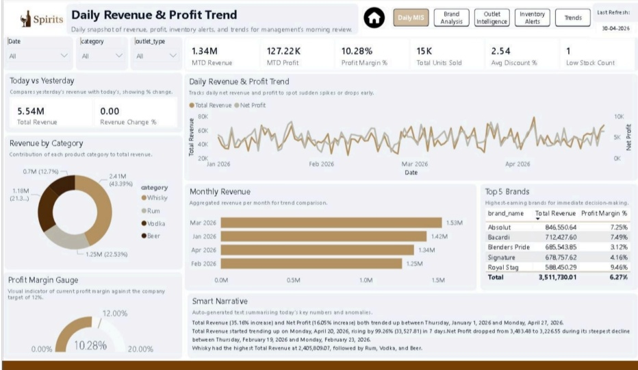
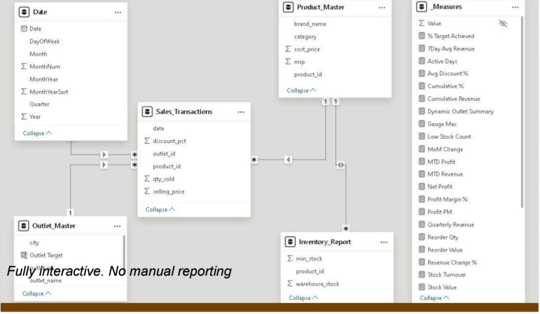
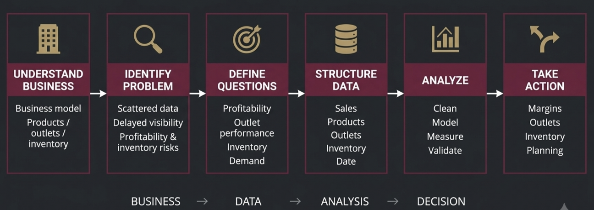
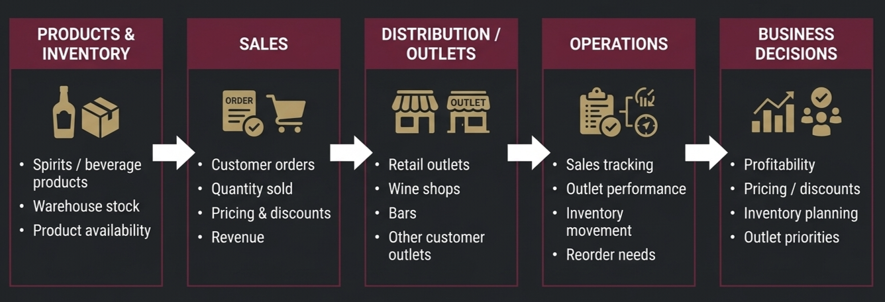

# HS Oberoi — Distribution & Inventory Analytics

  

Spirits distributors lose margins daily to unchecked discounting, scattered sales data, and poor inventory visibility. HS Oberoi was built to bring that chaos into a single, decision-ready view.

This project unifies sales, outlet performance, and inventory into one automated dashboard — helping business leaders stop manual reporting, protect net margins, and free up cash stuck in slow-moving stock.

---

📁 **[Download the Full Case Study (PDF)](./Docs/HS_Oberoi_Presentation.pdf)**

---

## How It Works

The foundation is a **Star Schema** — one fact table (`Sales_Transactions`) linked to dimensions for products, outlets, inventory, and date. This structure keeps reporting fast, consistent, and scalable.

  

To get there, I mapped the entire distribution flow — from product sourcing to outlet sales — and used that understanding to design the data pipeline and metrics that matter.

  

The project was structured around the questions teams actually ask, not just the tools available.

  

---

## Key Findings

- **Margin leakage** — 4 high-revenue brands were losing margins when discounts exceeded an 8% threshold.
- **Channel profitability** — Retail outlets delivered 55% higher net profit than bar channels.
- **Inventory risk** — 4 critical low-stock items were identified, requiring ₹1.2L in immediate reorder capital.
- **Demand pattern** — Mid-week sales (Mon–Thu) dropped 40% compared to weekends, highlighting a clear opportunity for targeted promotions.

---

**Pushpal Kawara**  
*I am the bridge where data turns into smarter business decisions*

📧 pushpalanalytics@gmail.com  
📞 +91 7796004314  
🔗 [linkedin.com/in/pushpalanalytics](https://www.linkedin.com/in/pushpalanalytics)  
🌐 [Your Portfolio Link Here]
(https://pushpalkawara.pages.dev)

